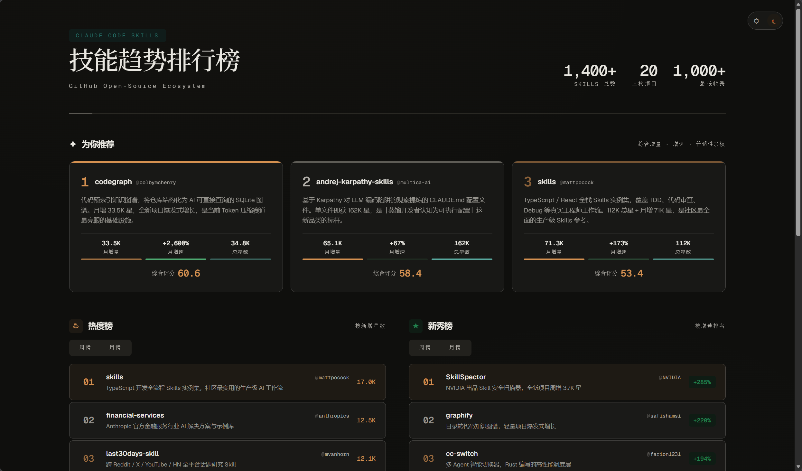
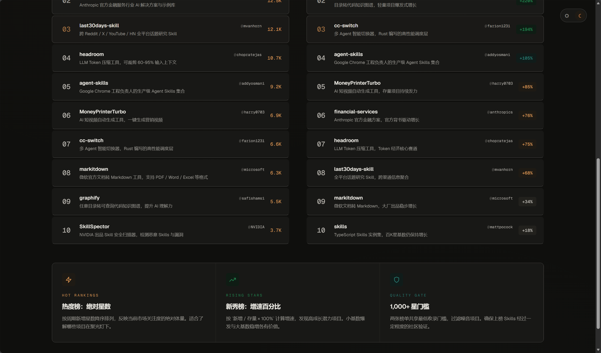

# 🔥 Fetch Skills Trend — Claude Code 技能趋势排行榜

[](LICENSE)
[](https://claude.ai/code)

一个 Claude Code 技能，自动搜索 GitHub 上热门的 Claude Code Skills 项目，生成一张**编辑风格的 HTML 趋势排行榜**。

> 当你说「最近 skill 趋势」「热门技能排行」「生成技能周报」时，它会自动搜集数据、多维排序、渲染出含热度榜、新秀榜和智能推荐的网页。

---

## 🎬 效果预览

生成的海报为暖白编辑风格，支持浅色/深色一键切换：

| 全局视图 | 深色模式 |
|----------|----------|
|  |  |

### 页面包含三个板块：

| 板块 | 位置 | 内容 |
|------|------|------|
| **✦ 为你推荐** | 顶部横排 3 卡片 | 加权综合评分 Top 3，含增量/增速/普适性指标条与详细描述 |
| **🔥 热度榜** | 左侧列 | 按周期新增星数降序 Top 10，支持周/月 Tab 切换 |
| **🌱 新秀榜** | 右侧列 | 按增速百分比降序 Top 10，支持周/月 Tab 切换 |

---

## 📦 安装

```bash
npx skills add CIZONE/fetch-skills-trend -g -y
```

或手动复制：

```bash
git clone https://github.com/CIZONE/fetch-skills-trend.git
cp -r fetch-skills-trend ~/.claude/skills/fetch-skills-trend
```

---

## 🚀 使用

在 Claude Code 中输入以下任一触发语：

| 触发语 | 示例 |
|--------|------|
| 最近 skill 趋势 | 「帮我看看最近 skill 趋势」 |
| skill 排行榜 | 「给我一个 skill 排行榜」 |
| 生成技能周报 | 「生成技能周报」 |
| trending skills | 「show me trending claude skills」 |
| 热门技能 | 「最近有什么热门技能？」 |

技能会自动：
1. **并行搜索** — 4 路 WebSearch 同时查询周度和月度 GitHub Trending 数据
2. **数据清洗** — 去重、筛除 ★<1,000 的低星项目
3. **多维排序** — 热度榜（绝对增量）、新秀榜（增速百分比）、为你推荐（加权综合）
4. **生成海报** — 将数据填入编辑风格 HTML 模板，零外部依赖
5. **输出文件** — 默认保存到 `C:\Users\CIZI\Desktop\Skill-Trend.html`

---

## 🏗️ 工作原理

```
用户说「生成技能周报」
        │
        ▼
┌──────────────────────────────┐
│  4 路并行 WebSearch           │
│  · 周度 trending × 2          │
│  · 月度 trending × 2          │
└──────────┬───────────────────┘
           ▼
┌──────────────────────────────┐
│  数据清洗 & 计算              │
│  · 去重、筛除 stars < 1,000   │
│  · 热度榜：按新增星数降序      │
│  · 新秀榜：按增速%降序        │
│  · 推荐：加权求和 Top 3       │
└──────────┬───────────────────┘
           ▼
┌──────────────────────────────┐
│  渲染 HTML                    │
│  · 读取 poster-template.html  │
│  · 注入 4 组榜单数据           │
│  · 纯 CSS Tab 切换             │
│  · 浅色/深色双模               │
└──────────┬───────────────────┘
           ▼
     输出 Skill-Trend.html
```

### 三张榜单的排序逻辑

| 榜单 | 排序依据 | 公式 |
|------|----------|------|
| 热度榜 | 周期新增星数（绝对量） | `rank = DESC(new_stars)` |
| 新秀榜 | 增速百分比 | `rate = new_stars / (total - new_stars) × 100%` |
| 为你推荐 | 加权综合评分 | `score = Σ(normalized_metric × weight)` |

---

## 📁 文件结构

```
fetch-skills-trend/
├── SKILL.md                    # 技能定义（触发条件 + 执行流程 + 公式）
├── assets/
│   └── poster-template.html    # 编辑风格 HTML 模板（CSS 变量 + 深色/浅色双模）
├── README.md                   # 本文件
├── preview-1.png               # 效果预览（浅色模式全局视图）
├── preview-2.png               # 效果预览（深色模式）
├── LICENSE                     # MIT License
└── .gitignore
```

---

## ⚙️ 自定义输出位置

默认输出到桌面 `C:\Users\CIZI\Desktop\Skill-Trend.html`。如需修改：

1. 打开 `SKILL.md`
2. 找到 `### 6. 输出` 章节
3. 修改代码块中的路径为你想要的路径，例如：
   ```
   D:\my-reports\Skill-Trend.html
   ```
4. 该行上方有 `<!-- ★ 自定义输出路径 ★ -->` 注释标记

---

## 🎨 模板自定义

修改 `assets/poster-template.html` 来定制海报风格——所有视觉参数集中在 CSS 变量中：

- **浅色主题** — 修改 `:root` 块中的变量（`--bg`, `--surface`, `--text` 等）
- **深色主题** — 修改 `[data-theme="dark"]` 块中的对应变量
- **强调色** — `--amber`（金/热度）、`--teal`（青）、`--green`（绿/新秀）
- **卡片** — 修改 `.card` 和 `.rec-card` 的 `border-radius`、`padding`、hover 效果
- **动画** — 修改 `@keyframes cardIn` 的 `duration` / `delay` 控制入场节奏

模板使用纯 CSS 实现所有视觉效果（包括 Tab 切换和深色/浅色模式），零外部 JS 依赖（仅主题 toggle 使用 10 行 vanilla JS），单文件即可运行。

---

## 📐 权重配置（「为你推荐」板块）

推荐算法使用三项指标的加权求和，从所有 1,000+ stars 的 skills 中评选 Top 3：

```
Score = (增量/最大增量) × W1 + (增速/最大增速) × W2 + (普适性/最大普适性) × W3
```

### 默认权重

| 权重 | 值 | 含义 |
|------|-----|------|
| **W1** | 0.3 | 增量权重 — 新增星数的绝对量，反映市场关注度体量 |
| **W2** | 0.4 | 增速权重 — 百分比增长率，倾向发现高潜力新星 |
| **W3** | 0.3 | 普适性权重 — 总星数作为通用性代理，反映社区验证程度 |

### 修改权重

**方法一**：修改 `SKILL.md`，搜索 `W1 = 0.3` 定位到 `#### 4.3` 章节，修改默认权重值。此方法影响技能运行时生成的所有 HTML。

**方法二**：直接修改输出 HTML 文件，搜索 `W1=0.3  W2=0.4  W3=0.3` 定位到推荐板块上方的注释行。修改后需重新计算评分并更新三张推荐卡片的数据。

> 三个权重之和应为 1.0。想倾向热门项目 → 提高 W1/W3；想发现新秀 → 提高 W2。

---

## 📄 License

MIT © 2026 CIZONE
