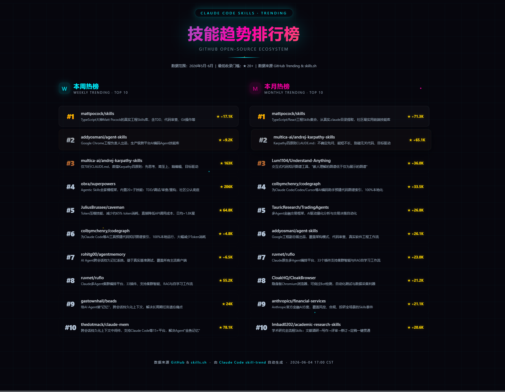

# 🔥 Skill Trend — Claude Code 技能趋势排行榜

[](LICENSE)
[](https://claude.ai/code)

一个 Claude Code 技能，自动搜索 GitHub 上热门的 Claude Code Skills 项目，生成一张**科技风海报**式的 HTML 趋势排行榜。

> 当你说「最近 skill 趋势」「热门技能排行」时，它会自动搜集数据、筛选排序、渲染出一张赛博朋克风格的网页。

---

## 🎬 效果预览

生成的海报包含：
- **左侧** → 本周热榜 TOP 10
- **右侧** → 本月热榜 TOP 10
- 深色网格背景 + 霓虹光效 + 粒子动画
- 金/银/铜排名渐变标识
- 每个技能简明扼要的一行介绍



---

## 📦 安装

```bash
npx skills add CIZONE/skill-trend -g -y
```

或手动复制：

```bash
git clone https://github.com/CIZONE/skill-trend.git
cp -r skill-trend ~/.claude/skills/skill-trend
```

---

## 🚀 使用

在 Claude Code 中输入以下任一触发语：

| 触发语 | 示例 |
|--------|------|
| 最近 skill 趋势 | 「帮我看看最近 skill 趋势」 |
| skill 排行榜 | 「给我一个 skill 排行榜」 |
| trending skills | 「show me trending claude skills」 |
| 热门技能 | 「最近有什么热门技能？」 |

技能会自动：
1. **并行搜索** — 4 路 WebSearch 同时查询周度和月度数据
2. **过滤清洗** — 去重、筛除 ★<20 的低星项目
3. **生成海报** — 将数据填入科技风 HTML 模板
4. **输出文件** — 保存到 `C:\Users\CIZI\Desktop\TEST\skill-trend-by-claude\index.html`

---

## 🏗️ 工作原理

```
用户说「最近skill趋势」
        │
        ▼
┌──────────────────────────────┐
│  4 路并行 WebSearch           │
│  · 周度 trending × 2          │
│  · 月度 trending × 2          │
└──────────┬───────────────────┘
           ▼
┌──────────────────────────────┐
│  数据清洗                     │
│  · 去重                       │
│  · 筛除 stars < 20            │
│  · 分类 周榜/月榜/双榜        │
└──────────┬───────────────────┘
           ▼
┌──────────────────────────────┐
│  渲染 HTML                    │
│  · 读取 poster-template.html  │
│  · 注入 TOP 10 数据           │
│  · 科技风海报样式             │
└──────────┬───────────────────┘
           ▼
      输出 index.html
```

---

## 📁 文件结构

```
skill-trend/
├── SKILL.md                    # 技能定义（触发条件 + 执行流程）
├── assets/
│   └── poster-template.html    # 科技风海报 HTML 模板
├── README.md                   # 本文件
├── LICENSE                     # MIT License
└── .gitignore
```

---

## 🎨 模板自定义

你可以修改 `assets/poster-template.html` 来定制海报风格：

- **配色** — 修改 CSS 中的 `#00f0ff`（青）、`#ff00aa`（品红）、`#ffd700`（金）
- **背景** — 调整 `background-size` 改变网格密度
- **卡片** — 修改 `.skill-card` 的圆角、透明度、hover 效果
- **动画** — 调整 `@keyframes float` 的参数改变粒子行为

模板使用纯 CSS 实现所有视觉效果，零外部依赖，单文件即可运行。

---

## 📄 License

MIT © 2026 CIZONE
